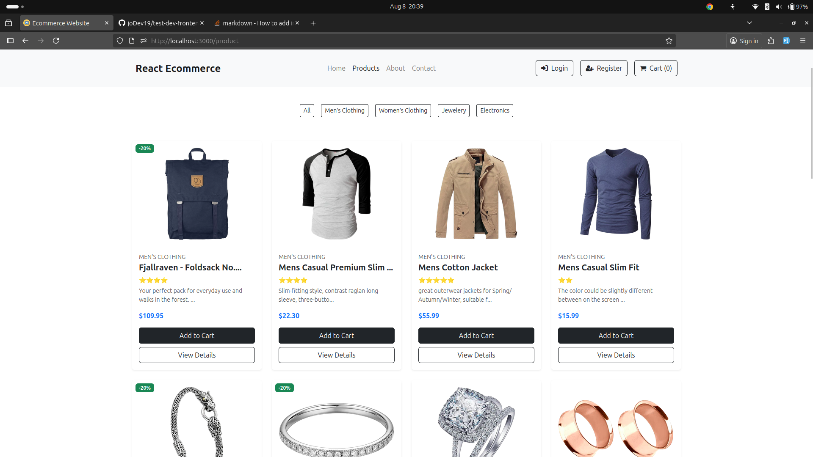
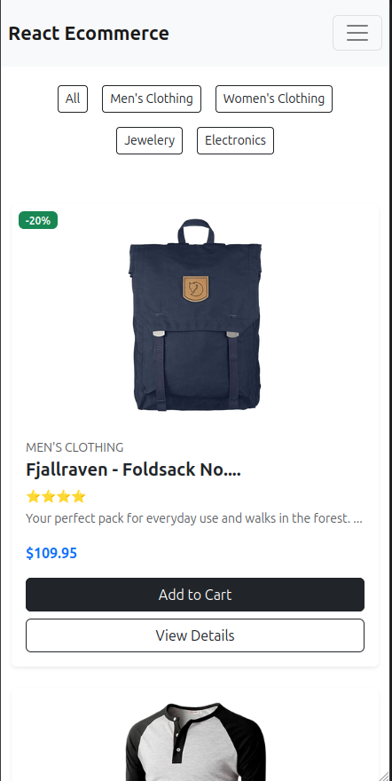

# Readme
My layout approach uses Bootstrap 5’s grid system to ensure a clean and consistent card arrangement across all screen sizes. Each product card includes an image, title, category, rating, description, price, and action buttons, with badges for “Out of Stock” or promotions. Subtle hover animations on product images and buttons enhance the user experience while keeping the design modern and minimal.

For responsiveness, the grid dynamically adjusts the number of columns (col-lg-3 col-md-4 col-sm-6 col-12) based on the screen width. Text truncation, scalable images (object-fit: contain), and fluid button widths ensure the layout adapts seamlessly to mobile, tablet, and desktop.
# Desktop image

# Mobile image
